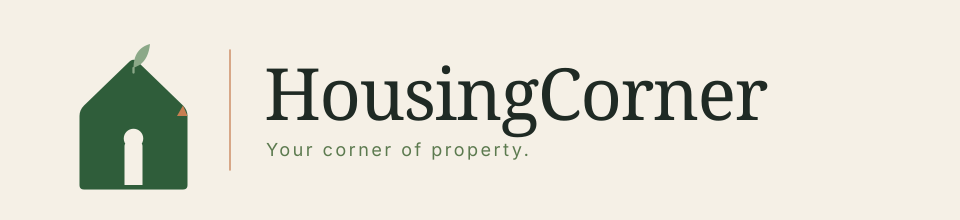
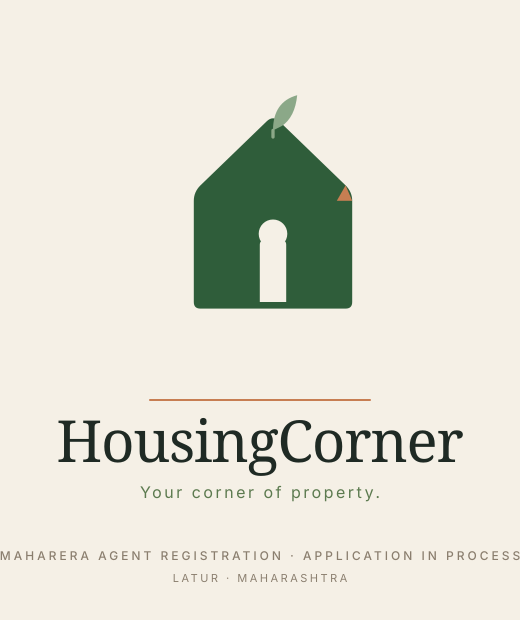
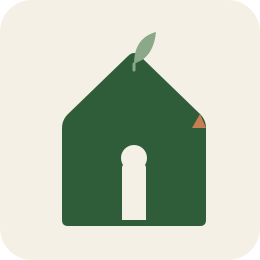
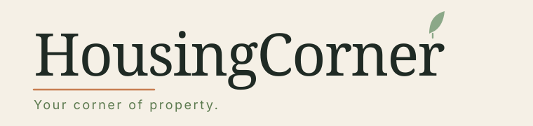

# HousingCorner — Logo & Brand Asset Reference

> **Direction locked: B · "Rooted Corner" (handcrafted / earth-tones).**
> A tech-forward alternative is kept in `logos/alt-techforward-*.svg` for reference only.

> ⚠️ **Brand-kit note.** Your existing `HousingCorner_Brand_and_MahaRERA.md` commits to tech-forward deep-green + cyan (Section 4) and Space Grotesk + DM Sans (Section 5). You've chosen to pivot to an earth-tone, humanist-serif system. Before you publish anything, update Sections 4 and 5 of that brand kit to reflect the new palette and typography below — otherwise future you / printers / web developers will get conflicting instructions.

---

## 1 · The idea in one line

> **A home with a leaf growing where the chimney would be, and a terracotta tile on its corner.**
> HousingCorner doesn't just move walls — it helps buyers plant roots in the *right* corner of Maharashtra.

Two visual anchors: the **leaf** (growth, life, roots) and the **terracotta corner** (the literal "Corner" in your name, in clay — a material buyers in Maharashtra viscerally associate with homes).

---

## 2 · What's in the folder

### `logos/` — the marks

| File | Use it for |
|---|---|
| `logos/housingcorner-combo.svg` | **Primary.** Website header, email header, invoice top, pitch deck slides after the cover. |
| `logos/housingcorner-stacked.svg` | Square / portrait placements — print ads, brochures, business cards. Includes a MahaRERA compliance line. |
| `logos/housingcorner-icon.svg` | App icon, favicon, social avatar, watermark. |
| `logos/housingcorner-monogram.svg` | LinkedIn avatar, document signet, corner-watermark when the pictorial icon feels too busy. |
| `logos/housingcorner-wordmark.svg` | Text-only — next to a large hero photo where an icon would be redundant. |
| `logos/alt-techforward-*.svg` (5 files) | Reference-only alternative if you ever reconsider the tech-forward deep-green + cyan direction. Don't mix with the primary system. |

### `assets/` — everything ready to ship

| File | Use it for | Size |
|---|---|---|
| `assets/business-card-front.svg` | Generic founder-led card front (Ram &amp; Rahul, both numbers, `info@`) | 90×55 mm |
| `assets/business-card-front-ram.svg` | Personalised front — Ram Kole, `ram@housingcorner.in`, +91 84848 02019 | 90×55 mm |
| `assets/business-card-front-rahul.svg` | Personalised front — Rahul Awale, `rahul@housingcorner.in`, +91 95619 04097 | 90×55 mm |
| `assets/business-card-back.svg` | Business card back, branded (shared) | 90×55 mm |
| `assets/letterhead.svg` | A4 letterhead with header + footer compliance block | A4 @300 dpi |
| `assets/email-signature.html` | Generic founder-led signature (both names, `info@`). Host the logo and paste into Gmail | HTML |
| `assets/email-signature-ram.html` | Personalised signature — Ram | HTML |
| `assets/email-signature-rahul.html` | Personalised signature — Rahul | HTML |
| `assets/whatsapp-avatar.svg` | WhatsApp Business profile picture, bold & legible at 40px | 640×640 |
| `assets/favicon.svg` | Website favicon, simplified for 16–64px rendering | 64×64 |
| `assets/linkedin-banner.svg` | LinkedIn company-page banner | 1584×396 |
| `assets/pitch-deck-cover.svg` | Pitch deck opener slide for builder meetings | 1920×1080 |
| `assets/instagram-post-template.svg` | Instagram 1:1 template — replace the `[headline]` placeholders | 1080×1080 |
| `assets/property-watermark.svg` | Translucent corner stamp for property photos on your website / WhatsApp | 400×140 |
| `assets/yard-sign.svg` | On-site "For Sale" yard sign / flex board | 3:4 portrait |

---

## 3 · Brand DNA (single source of truth)

### Colors

| Role | Name | Hex | Usage |
|---|---|---|---|
| Primary | Forest Green | `#2F5D3A` | The mark, main text, strong UI elements. Trust, grounding. |
| Accent | Terracotta Clay | `#C77E52` | Corner accents, dividers, call-to-action buttons. Roughly 10% of any surface. |
| Soft accent | Sage | `#8BA888` | The leaf, illustrations, tag chips. |
| Surface | Warm Cream | `#F5F0E6` | All backgrounds. Never use pure white — it fights the warmth. |
| Ink | Deep Earth | `#1F2A24` | Body text. A softer black. |
| Neutral | Warm Stone | `#8A7E6E` | Captions, metadata, MahaRERA compliance lines. |
| Supporting green | Muted Sage-Green | `#5C7A4F` | Tagline, secondary text on cream. |

### Typography

| Use | Font | Weight | Fallback |
|---|---|---|---|
| Wordmark / H1–H2 | **Fraunces** | 500 | Playfair Display → Recoleta → Georgia |
| Sub-heads / labels | **Inter** | 500 (spaced) | Helvetica Neue → Arial |
| Body / paragraph | **Inter** | 400 | Helvetica Neue → Arial |

Both free on Google Fonts. Fraunces carries warmth without being decorative — it's what makes the brand feel handcrafted-but-professional. Use `letter-spacing: -0.02em` on Fraunces at large sizes.

### Symbol system

- **House silhouette** — shelter, home, the "Housing."
- **Sage leaf at the peak** — growth, roots, life. Replaces the chimney because buyers aren't looking for smoke, they're looking for a future.
- **Terracotta corner tile** — the literal "Corner" in HousingCorner, rendered in clay — a Maharashtra-native material that reads as *home* to any buyer here.
- **Small right-angle `⌐` accent** (used occasionally on wordmark & monogram) — reinforces the "Corner" motif without being literal.

---

## 4 · Usage rules

**Do**
- Give the logo clear space equal to the height of the leaf on all sides.
- Use on warm cream, white, or forest-green backgrounds.
- Shrink to the icon or monogram under 140px wide; the combo needs breathing room.
- Keep terracotta as an accent — under ~10% of any visible surface.

**Don't**
- Don't stretch, skew, rotate, or drop-shadow.
- Don't recolor the leaf to anything but sage or forest green.
- Don't hyphenate or split "HousingCorner" across lines — it's one word.
- Don't mix Direction B (this system) with the alt-techforward cyan files.
- Don't use the property watermark over dark/busy image areas — move it to a calmer corner.

**Minimum sizes**
- Icon: 24 px · Monogram: 32 px · Combo: 160 px wide · Stacked: 120 px wide · Letterhead header: 60 mm wide.

---

## 5 · Inline previews

Primary combo:

Stacked:

Icon and monogram:
 

Wordmark:

> Open the SVGs directly in any browser if your markdown viewer doesn't render them inline.

---

## 6 · Export checklist (what to do before launch)

I've delivered SVGs because they're the master format — infinitely scalable and editable. For each deliverable below, export from SVG to the listed formats using Figma / Affinity / Inkscape (or ask me to generate them).

**Web**
- `housingcorner-combo.svg` → PNG @1x (600 px), @2x (1200 px), @3x (1800 px). Use in site header.
- `favicon.svg` → `favicon.ico` (multi-res 16/32/48) + `apple-touch-icon.png` (180×180).
- `og-image.png` (1200×630) — I can build this next; ask.

**Social**
- `whatsapp-avatar.svg` → PNG 640×640. Upload to WhatsApp Business profile.
- `whatsapp-avatar.svg` → PNG 400×400 cropped circle. Upload to LinkedIn, Instagram, Facebook, YouTube profile.
- `linkedin-banner.svg` → PNG 1584×396. Upload to LinkedIn company page.

**Print** (convert to CMYK for press)
- `business-card-front.svg` + `business-card-back.svg` → PDF/X-1a with 3 mm bleed. Print on 300 gsm matte card.
- `letterhead.svg` → PDF. Print on 100 gsm matte A4.
- `yard-sign.svg` → PDF at target board size (commonly 2 × 3 ft flex).

**Doc templates**
- `pitch-deck-cover.svg` → Insert as slide 1 in Google Slides / PowerPoint.
- `email-signature.html` → Paste into Gmail signature; replace placeholders and the hosted logo URL.

---

## 7 · What's baked in vs. still open

**Baked in (Apr 2026)**

- **Founders:** Ram Kole &amp; Rahul Awale (across cards, letterhead, pitch deck, email sig, landing page).
- **Contact:** +91 84848 02019 (Ram) · +91 95619 04097 (Rahul) · `ram@housingcorner.in` · `rahul@housingcorner.in` · `info@housingcorner.in`.
- **Location:** Latur, Maharashtra (street address still to add once office is confirmed).
- **MahaRERA status:** Wording everywhere softened to **"Application in process"** — legally safer until the agent registration number is issued.

**Still open — send when ready**

1. **Legal entity clarification.** Two founders implies a **Partnership firm** (not a Sole Proprietorship). This changes the MahaRERA agent application form — registered Partnership firms apply with a different set of documents (partnership deed, PAN of the firm, list of partners, etc.) than an individual sole proprietor. Either (a) register a partnership firm under the Indian Partnership Act and apply to MahaRERA as a firm, or (b) pick one founder to apply as the registered agent with the other as "authorised signatory / associate." Tell me which route and I'll adjust the `HousingCorner_Brand_and_MahaRERA.md` application pack accordingly — right now it's still drafted for a sole-prop.
2. **MahaRERA registration number.** Once issued, I'll replace every "Application in process" line with the actual `A51XXXXXXXXXXXX` number.
3. **Office address** for letterhead, card back, and Google Business.
4. **Firm PAN** (if you go the partnership route) or individual PANs of each partner.
5. **Property photo master** — send one typical listing photo and I'll mock up how the watermark sits over a real image.
6. **Additional assets to build next (on request):** website homepage mockup, brochure spread, WhatsApp status template, festive-greeting template (Gudi Padwa / Diwali), invoice template, SMS/email broadcast template.

Reply with any or all — I'll extend this system into whatever you need.
